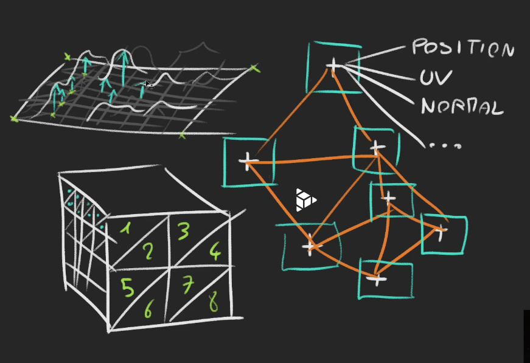

## 认识几何概念构建几何体

### 几何体
一个模型由很多三角形组成，而每个顶点有三种最重要的信息：

- 位置（Position）：三维空间中的点 (x, y, z)

- UV 坐标（Texture Coordinates）：二维贴图上的点 (u, v)

- 法线向量（Normal）：表示“朝向”的三维方向 (nx, ny, nz)

### BoxGeometry
后三个参数，分别代表x,y,z轴上有多少个轴线
轴线决定了每个面由多少个三角形组成，一个集合体是由点=>面=>几何

### 为什么需要很多三角形
比如要建造一片地形，如果只有外边的4个顶点，就无法构建地形。假如设置了很多轴线就会有很多三角形，也就是你通过某个三角形的顶点来构造你想要的地形。

### wireframe
展示轴线

