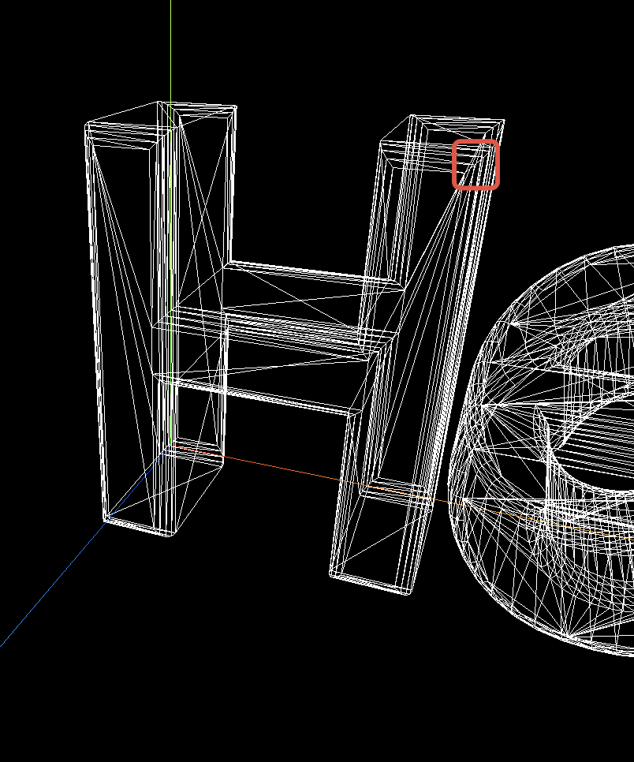
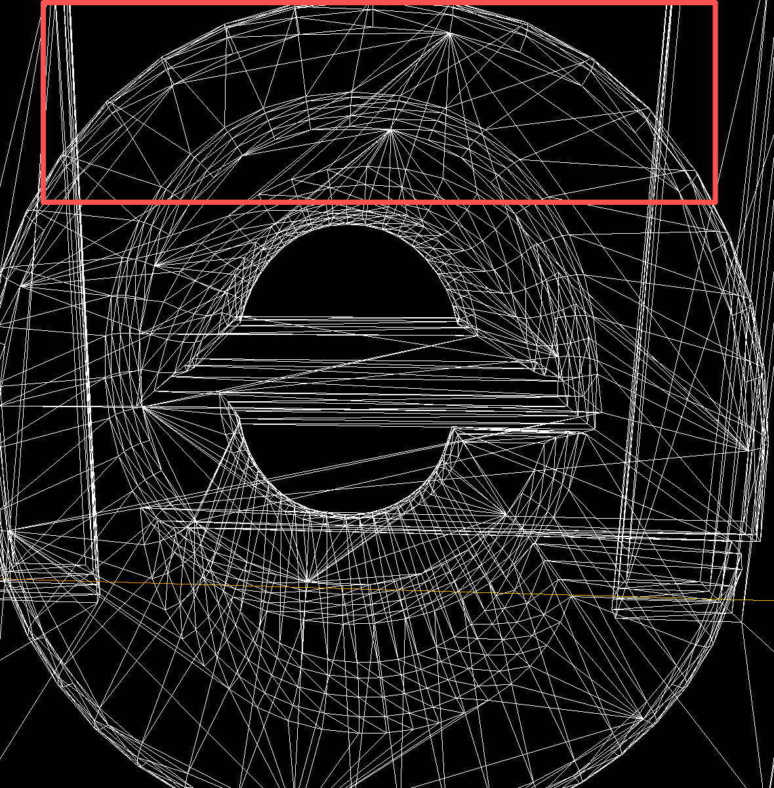
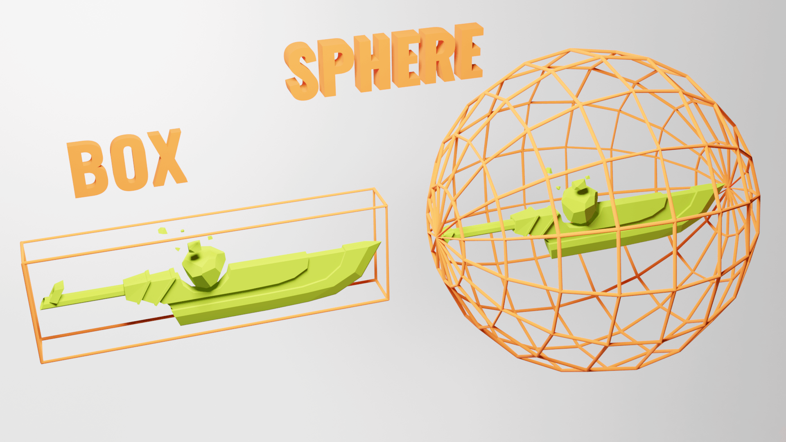

## 文字

### bevelSegments 倒角段
斜面层数、比如H字母角上的弧度段数

### curveSegments 曲线段
曲线上的点数，比如O字母上弧度上的点数

### 优化性能
- 通常我们在默认视角下看到渲染正常的话就可以调试bevelSegments、curveSegments减小文字几何体中渲染的三角形数量。这样也不影响展示效果
- 多个网格可以使用相同的材质，也可以使用相同的几何体，不用重复创建。

### 边界
边界条件是指与几何图形相关的信息，它描述了该几何图形所占据的空间范围。它可以是一个长方体，也可以是一个球体。

### Frustum Culling 视锥体剔除
只渲染相机看到的物体。
